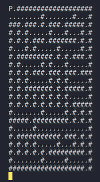

## Laberinto  -->  Proyecto_integrador
Escribir un programa que corra un bucle infinito leyendo e imprimiento las teclas y sólo terminará cuando se presione la tecla ↑ indicada como UP. Proyecto educativo en el programa Data Science plataforma Ada School.

#### main
Inicialmente se interactua con el usuario tomando algunos datos e imprimiendolos por pantalla.

### game
Implementar un juego de recorrer laberintos, estará basado enteramente en la terminal y trabajaremos con caracteres ASCII. 

Para jugar, debes instalar la liberia readchar e implementar el codigo desde la consola.

Usa las flechas del teclado (w s a d ) o (↑ ↓ ← →) para guiarte y moverte por el laberinto. El juego te muestra donde esta el Puntero y los diferentes caminos que puedes recorrer delineados con puntos.

Pero cuidado, si te chocas con una pared (#), tendrás que retroceder y buscar otro camino. El juego es dinámico y divertido, ya que cada vez que completas un laberinto, se carga uno nuevo. Así nunca te aburrirás de explorar estos laberintos!

¿Estás listo para el reto?

usar la librería `readchar` que nos permitirá leer un caracter suelto del teclado.
Instalar la librería: https://pypi.org/project/readchar/

Elaborado por ***José Maya***
